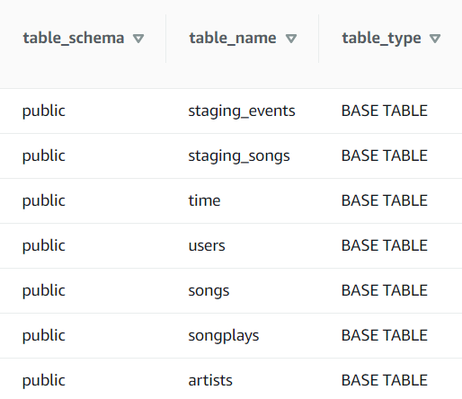
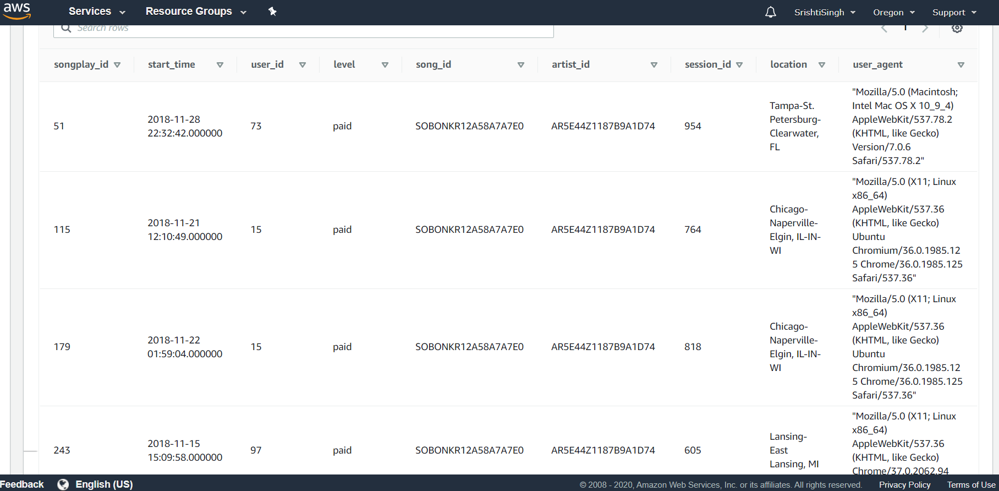
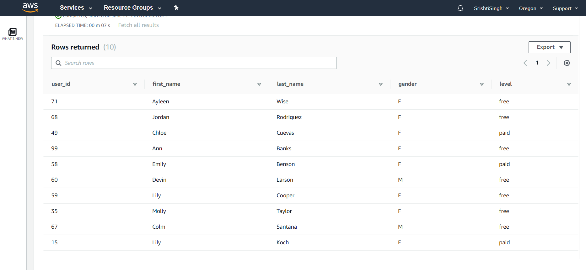
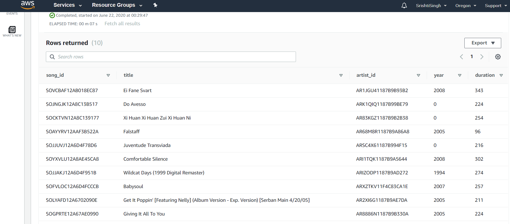
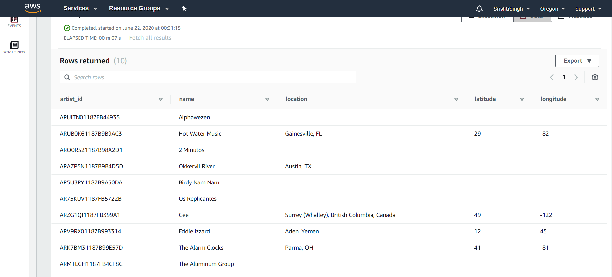
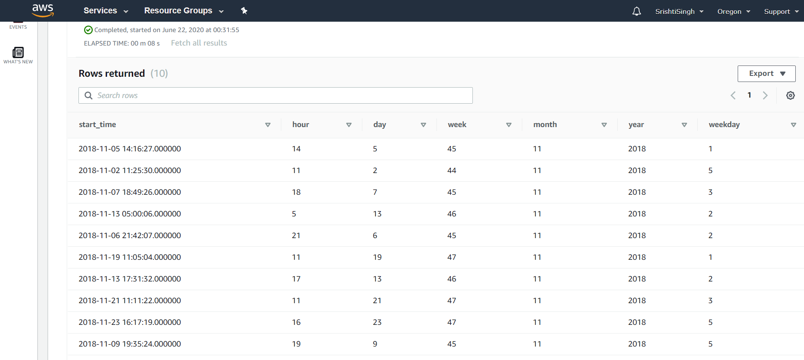
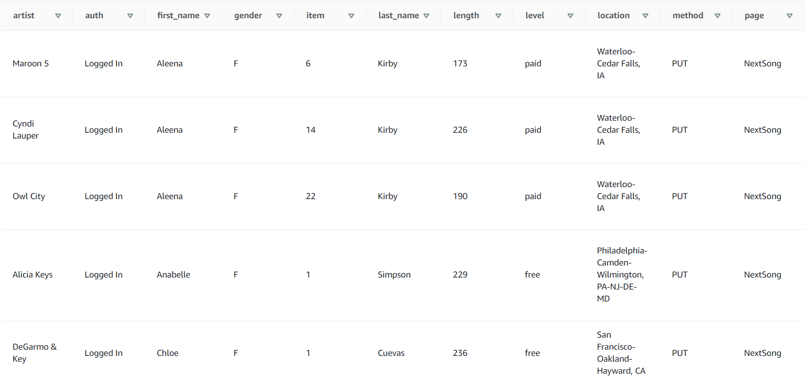
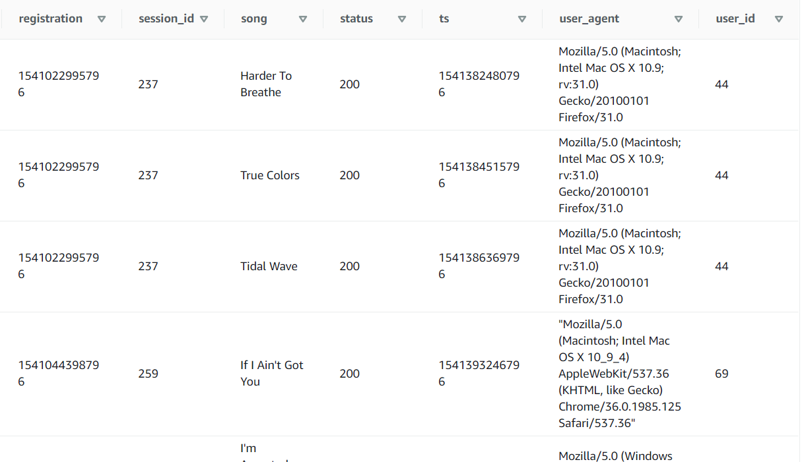
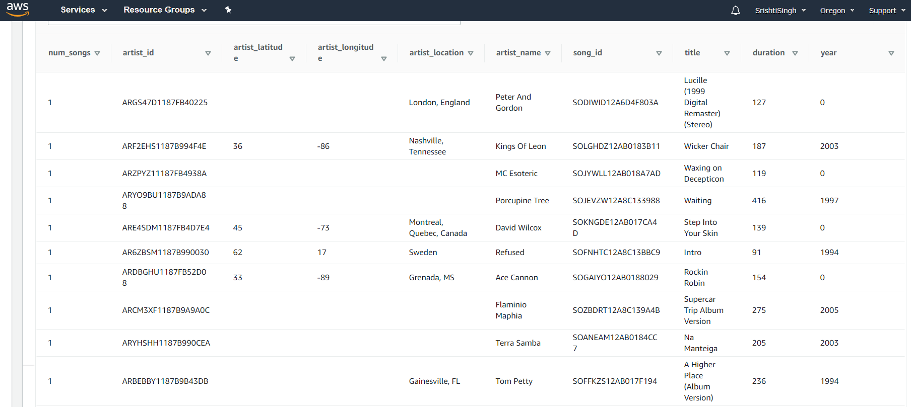

# Data Warehousing using AWS

This project was completed as a part of Udacity's Data Engineering Nanodeggree Program.

# Project Description

This project aims to create a database (**Sparkify**) and building an ETL pipeline to create this database from the data that has been collected. Since the user base and song database is huge, the processes and data was stored onto the cloud. The data resided in Amazon S3, in a directory of JSON logs of user activity on the app, as well as a directory with JSON metadata of the songs. The main goal of this database is to enable analysis of this data to get information about user preferences and to build a recommendation system. This was enabled by building a databse designed as a star schema with songplay table as the fact table which contains all the log data and having several dimension tables which store details of users, songs, artists and time the songs were played. The data is extracted from S3, staged in to the Redshift, and then transformed into a set of facts and dimensiona tables for their analytics team to continue finding insights in what songs the users are listening to.

# Database Schema

A star schema based design was created for the Sparkify database to have optimized queries to get details of songs played by users. Star schema is suited for this purpose since we have a log file which contains all the metrics and then we can have details about the attributes in the fact table linked to the dimension tables. Moreover, on the Redshift cluster 4 nodes were used to process queries and store data.

Entire dataset was first loaded from S3 bucket onto the following two staging tables in Redshift.

### Staging tables

#### `staging_events`

This table was created to store the enitre log data on Redshift which was extracted from S3 bucket.

|*Attributes*|artist|auth|first_name|gender|item|last_name|length|level|location|method|page|registration|session_id|song|status|ts|user_agent|user_id|
|--|--|--|--|--|--|--|--|--|--|--|--|--|--|--|--|--|--|--|
|***Datatypes***|varchar(max)|varchar(max)|varchar(max)|char|int|varchar(max)|decimal|varchar(max)|varchar(max)|varchar(max)|varchar(max)|bigint|int|varchar(max)|int|bigint|varchar(max)|int|

#### `staging_songs`

This table was created to store the enitre song data on Redshift which was extracted from S3 bucket.

|*Attributes*|num_songs|artist_id|artist_latitude|artist_longitude|artist_location|artist_name|song_id|title|duration|year|
|--|--|--|--|--|--|--|--|--|--|--|
|***Datatypes***|int|varchar(max)|decimal|decimal|varchar(max)|varchar(max)|varchar(max)|varchar(max)|decimal|int|

## Star Schema

### Fact table

#### `songplays`

This table was created using the logs that were collected when users played any song.

|*Attributes*|songplay_id|start_time|user_id|level|song_id|artist_id|session_id|location|user_agent|
|--|--|--|--|--|--|--|--|--|--|
|***Datatypes***|int|timestamp|int|varchar(max)|varchar(max)|varchar(max)|int|varchar(max)|varchar(max)|

Primary Key: songplay_id

### Dimension Tables

#### `users`

This table contains the details of each user.

|*Attributes*|user_id|first_name|last_name|gender|level|
|--|--|--|--|--|--|
|***Datatypes***|int|varchar(max)|varchar(max)|char|varchar(max)|

Primary Key: user_id

#### `songs`

This table contains the details for each of the songs.

|*Attributes*|song_id|title|artist_id|year|duration|
|--|--|--|--|--|--|
|***Datatypes***|varchar(max)|varchar(max)|varchar(max)|int|decimal|

Primary Key: song_id

#### `artists`

The table to store artist details.

|*Attributes*|artist_id|name|location|latitude|longitude|
|--|--|--|--|--|--|
|***Datatypes***|varchar(max)|varchar(max)|varchar(max)|decimal|decimal|

Primary Key: artist_id

#### `time`

This table stores the start time when a song was played and all the attributes associated to that time stamp.

|*Attributes*|start_time|hour|day|week|month|year|weekday|
|--|--|--|--|--|--|--|--|
|***Datatypes***|timestamp|int|int|int|int|int|int|

Primary Key: start_time

# ETL pipeline

The steps followed to build the ETL pipeline are as follows:

- Songs data files were extracted from the S3 bucket and entire data was loaded onto the Redshift cluster in a staging table.

- Log data files were extracted from the S3 bucket and entire data was loaded onto the Redshift cluster in a staging table.

- The staging tables were used to populate all the tables in the schema.

- Songs staging table as well as events staging table were used to extract required data to be stored in songplays table.

- Events staging table was used to transform data into the users and time table.

- Songs staging table was used to tranform the data into the songs and artists table.

The data was loaded with partitioning to parallelize the process and save time.

# Snapshots

Snapshots of all the tables are as follows:

Songplays

Users

Songs

Artists

Time

Staging Events

Staging Songs

# Data Analysis

The databse can be used to perform data analysis and gather information about the user preferences.

Example of a few queries that can be perfoemed are:

- Analyze the number of users that are paying for the service and the number of users who are using the platform for free.
    - SELECT level, count(*) FROM users GROUP BY level;
    - This gives the output as 82 free users and 22 paid users.
- The top users, songs and artists can also be extracted using the songplays table to get the information about who are the most frequent users, what songs people play most often and the artists whom users listens to the most.
    - SELECT song_id, count(*) AS c FROM songplays GROUP BY song_id ORDER BY c desc LIMIT 10;
    - The above query will give the top 10 frequently played songs.
    - Similarlly, details of users, artists, etc acn also be achieved and analyzed.

# File description

The repository contains the following files/folders:

- sql_queries.py
This file contains all the SQL queries required in the project including queries to drop, create, copy and insert.

- create_tables.py
This file can be executed by giving the command "python3 create_tables.py". This will create all the tables in the Sparkify database including staging tables.

- etl.py
This file can be executed using the "python3 etl.py" command and contains the entire ETL pipline required to extract, transform and load the data. Executing this file will copy the entire data from S3 bucket to Redshift and then use this staged data to populate all the tables in the schema.

- dwh.cfg
Thhis file contains all the configuration parameters required to run the commands on Redshift cluster and extrct data from S3.

- README.md
This file contains the description about the project, database, databse schema and the ETL pipeline.

- redshift_cluster.py
This file can be executed using "python3 redshift_cluster.py" command and will create an IAM role as well as a Redshift cluster to read from S3.

- delete_cluster.py
This file can be executed using "python3 delete_cluster.py" command and will delete the IAM role created earlier with read-only access to S3 as well as the Redshift cluster.

- images/
This folder contains all the images used in readme file
